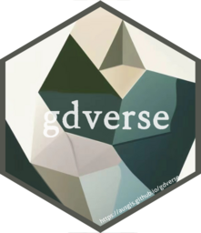

```{r setup, include = FALSE}
knitr::opts_chunk$set(echo = TRUE,
                      dpi = 300,
                      warning = FALSE,
                      message = FALSE,
                      out.width = "100%",
                      out.height = "100%",
                      fig.align = 'center',
                      comment = "##")
```

```r
library(showtext)
showtext_auto(enable = TRUE)
font_add("ShineTypewriter", regular = "./ShineTypewriter-lgwzd.ttf")
library(magick)

library(hexSticker)
sticker(
  subplot = './logo1.png',
  s_x = 0.97,
  s_y = 0.98,
  s_width = 1.5,
  s_height = 1.5,
  package = "gdverse",
  p_family = "ShineTypewriter",
  p_size = 25,
  p_color = ggplot2::alpha("#ffffff",.85),
  p_x = 1.05,
  p_y = 1,
  dpi = 300,
  asp = 1,
  h_size = 2.15,
  h_color = ggplot2::alpha("#54564f",1),
  h_fill = ggplot2::alpha('#ffffff',0),
  white_around_sticker = T,
  url = "https://ausgis.github.io/gdverse",
  u_color = "white",
  u_size = 4.25,
  filename = "gdverse_logo1.png"
)

image_read('./gdverse_logo1.png') |> 
  image_resize("256x256")|> 
  image_write('./gdverse_logo.png')

# finally make sdsfun_logo1.png background transparent
# https://uutool.cn/img-matting/
```




**Thanks to `Cao Yue` for her help on background image extraction.**